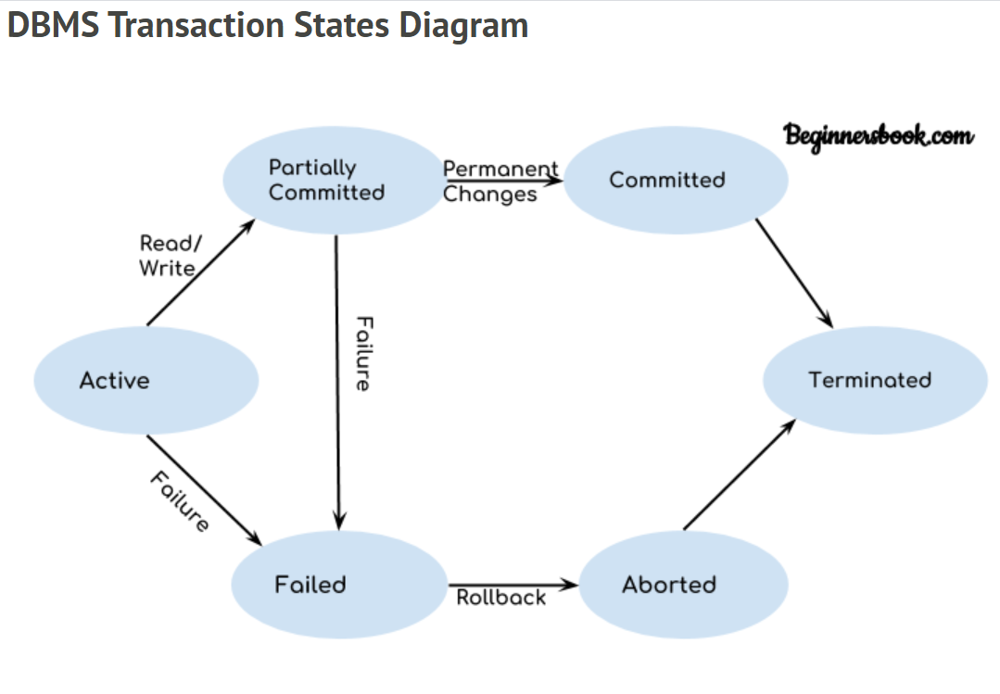

# Transactions

## States of transaction


x

## ACID Properties

> ATOMICITY

* example: balance transfer <br/>
  transfer Rs.10 from A -> B. <br/>
  Steps for transfer: <br/>
  1. Read(A)
  2. Update(A) => A = A-10
  3. Write(A)
  4. Read(B)
  5. Update(B) => B = B+10
  6. Write(B)
  7. Finish
* In this case Either All steps execute Or None of them execute. If failure happens at any step before completion then rollback happens.

> CONSISTENCY

* If a database is consistent before transaction then it will remain consistent afterwards.
* Any transaction must follow all the rules related to database including constraint, triggers etc.

> ISOLATION

* Logical Isolation : All the parallel transactions occur independently.
* The transactions occur such that they are happening independently.
* Example: Different orders happen in a restraunt parallely independent of each other.
* Concurrency control component takes care of isolation.

> DURABILITY

* Values in a database after transaction should always persist.

***

## Transaction management

* In a transaction : operations happen in a separate table : Local buffer in main memry which is a copy of an original table.
* Local buffer stays in main memory hence all the read write operations occur in local buffer.

> *Dirty Read*

* [Youtube Resource](https://www.youtube.com/watch?v=CPOfYF0Ya6E&list=PLmXKhU9FNesR1rSES7oLdJaNFgmuj0SYV&index=57)
* If a transaction reads a value from local buffer which has been written by any other active **uncommited transaction**.

```
Dirty read is not a problem if the transaction T2 which reads the value commits after the commit of transaction T1 which has updated that value before T2's read operation
```

> Lost Update Problem (Write-Write conflict)

* If transaction T2 writes without any read operation and commits then written value by any other transaction T1 that has written value before T2 may get lost.

### Schedule for Transactions

* Planning of execution for multiple transactions with context swicthing between them keeping the order of instructions amongst each transaction intact.
* This provides the feel of multiple programming.

> SERIAL SCHEDULE

* Unless one transaction commits or finished any other transaction doesn't get started.

> NON SERIAL SCHEDULE

* It is not necessary that non serial schedules are non consistent. 
* If a non-serial schedule can be converted to serial by swapping the instruction then it is called serializable and gives guarantee of being consistent.

> Conflict Serializable

* If there is a read - write pair or write - write (blind write) from two transactions T1 and T2 on same value then those two instructions in T1 and T2 can not be swapped.
* Tips tp make precedence graph to check the serializability: 
[resource](https://www.youtube.com/watch?v=QkROSmKbVFQ&list=PLmXKhU9FNesR1rSES7oLdJaNFgmuj0SYV&index=63)

> Irrecoverable Schedule

* If there is a dirty read in schedule then commit should happen in the same order in which dirty read execution hapened otherwise it is a irrecoverable schedule.
* If there is no dirty read then schedule is always recoverable.

***

## Concurrency control techniques

* There are protocols which ensures the conflict serializability for while developing the schedule.

> Timestamping T.S.

* Deciding the order of transactions before they enter the system. So, in case of conflict we can use the order.
* Time of a system is being alloted to a transaction while entry.
* In a conflict serializable schedule, early transaction commits early.
* There is a write time stamp (WTS(A)) and Read time stamp (RTS(S)) attached to every value (data item) being used to check the most junior transaction which have done the corresponding operation.
* **While Reading:** Senior transaction T1 will never read after write of junior transaction T2 and if it tries to do that then T1 will have to rollback. <br/>
i.e,In case of Read(A) by T1 :<br/>
if T.S.(T1) < WTS(A) then T1 rollsback <br/>
else transaction is allowed.
* **While Writing:** Senior transaction T1 will never write after read of junior transaction T2 and if it tries to do that then T1 rollbacks.
* **While writing:** Senior transaction T1 will never write after write operation of junior transaction T2 if it does then T1 has to rollback.

> Lock based protocol

* To achieve the isolation, transaction obtain a lock on data item A, inorder to perform operation and release the lock afterwards.
* **SHARED LOCK**: This is used for read operation and multiple transactions can obtain shared lock on single data item.
* **EXCLUSIVE LOCK**:  This comes in role when write operation needs to be done. No other lock can be obtained by other transactions if any transaction has exclusive lock on data item.

```
Lock based appoach alone never cares for conflict serializability and recoverability which means consistency is not guaranteed. Hence we look for advancement in locking.
```

> BASIC TWO PHASE LOCKING

* Schedule for one transaction is divided in two phases : GROWING AND SHRINKKING PHASE.
* **GROWING PHASE:** In this phase locks are obtained. Lock can not be released in this phase.
* **SHRINKING PHASE:** This begins with the first unlock and it cannot obtain lock on any data item in this phase and only release the lock.
* It provides poor concurrency. This ensures conflict serializability but not recoverability.

> CONSERVATIVE LOCK

* Purpose of this schedule is to solve deadlock problem.
* It only starts working when all the locks required on all data item are obtained.
* If all the locks are not available then transaction has to release all the obtained locks.
* It doesn't ensures recoverability but ensures confict serializability. 
